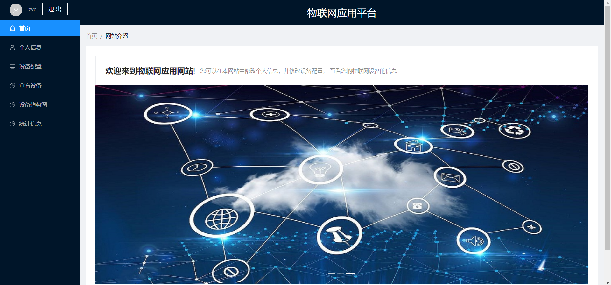
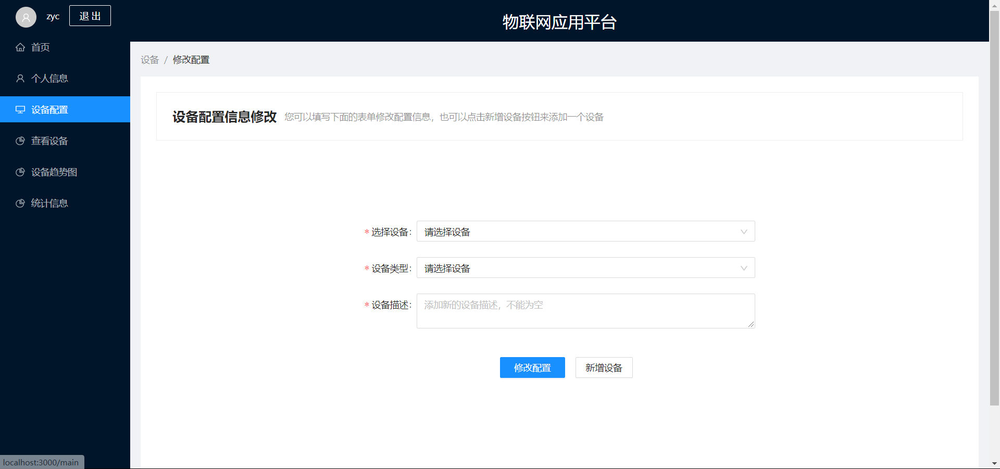
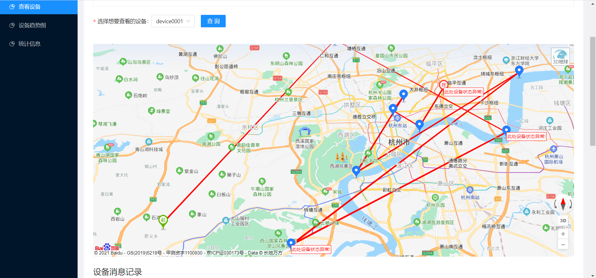
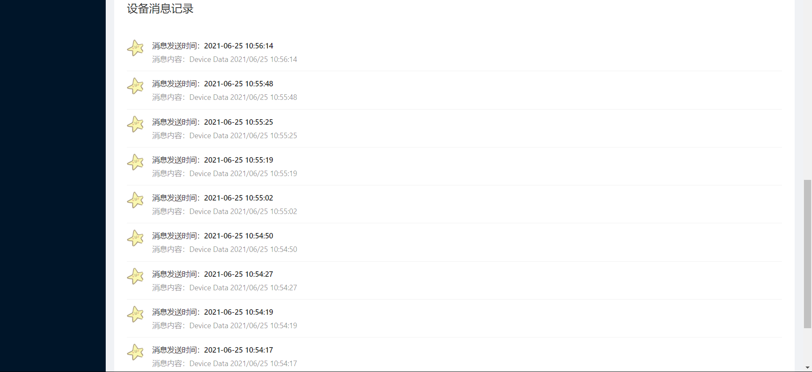
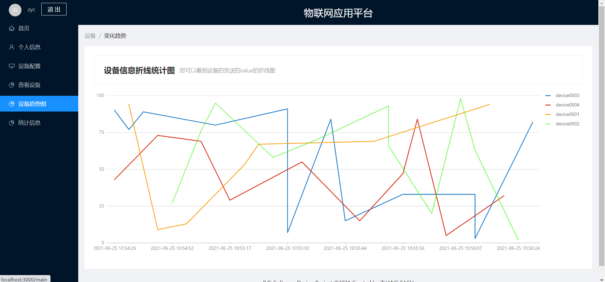
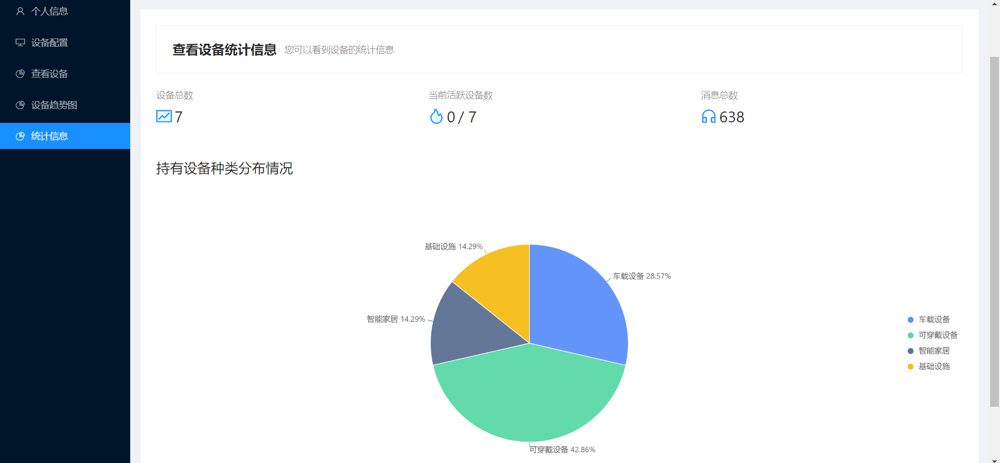

# IoT Device Management Website

- Course Project of  **B/S software design,2020-2021 Spring & Summer**

- A website with the following functions
  - Log in & Register
  - Personal Infomation Management
  - IoT Device Information Management
  - Visulization of the device track(Baidu Map)
  - Show messages from device in MQTT protocol
  - Visualization of the variation trend of devices' value(Broken line Graph)
  - Meta information statistics of device
- A simple full-stack project, just for fun

## Development Frameworks

- Front End: React + Ant Deisgn + Ant Design Charts + Baidu Map SDK + Yarn
- Back End: Spring Boot + Redis + MySQL + Mybatis
- MQTT Server: Python + Paho + Mosquitte

## Preview

